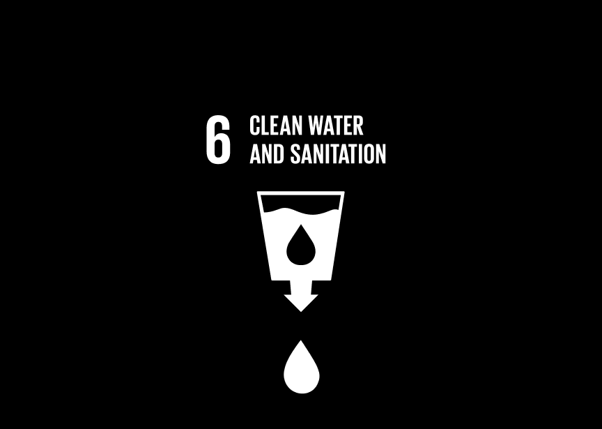
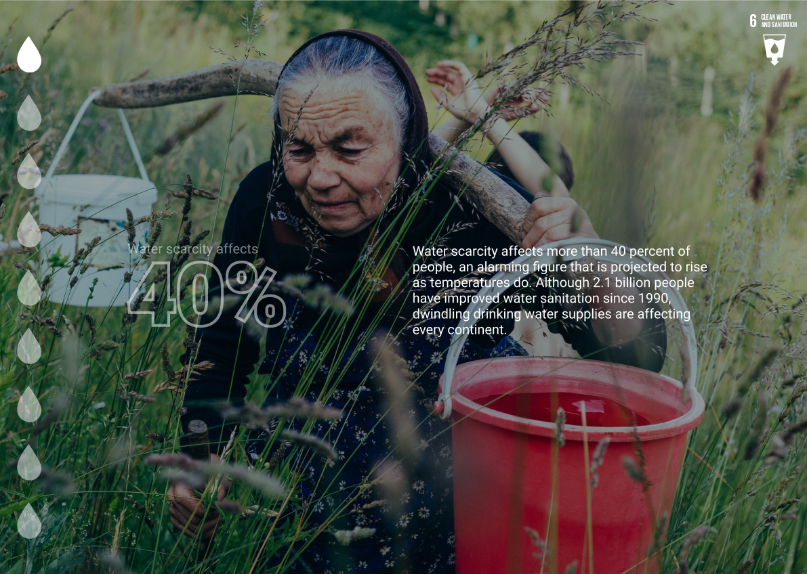
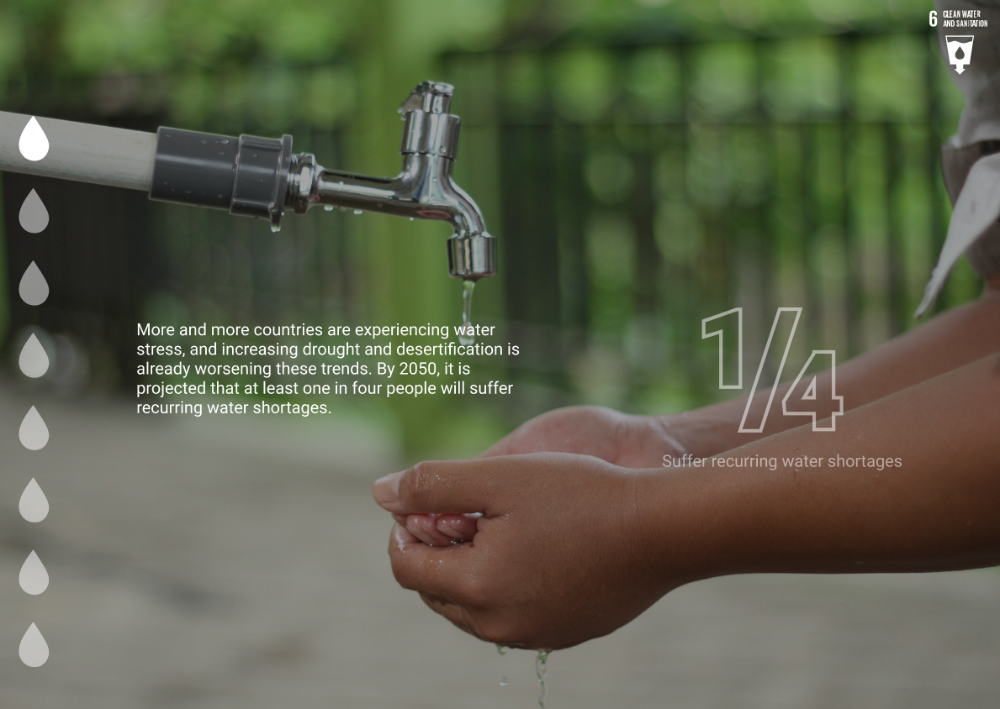
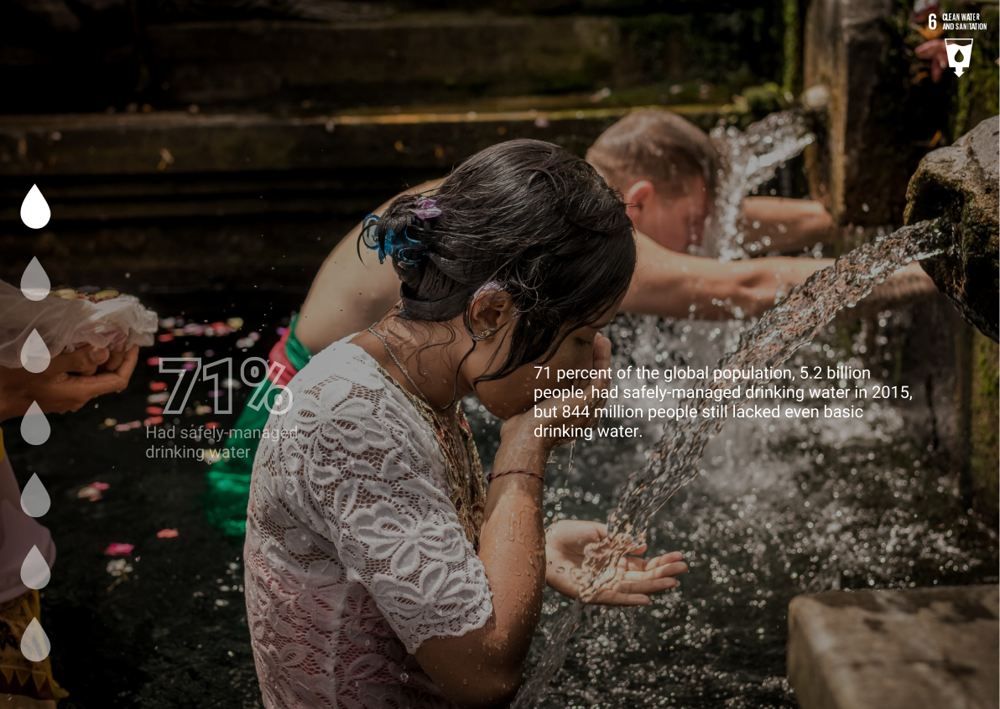
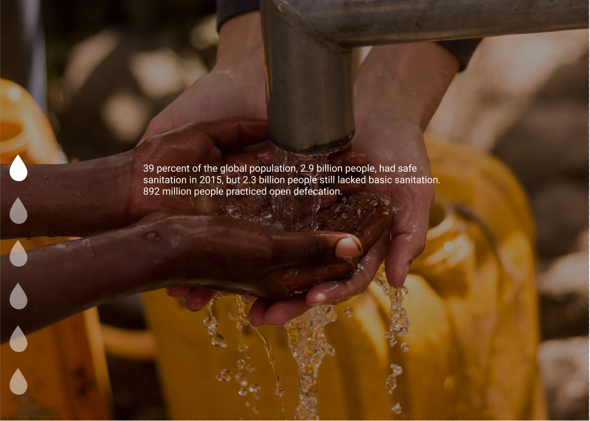
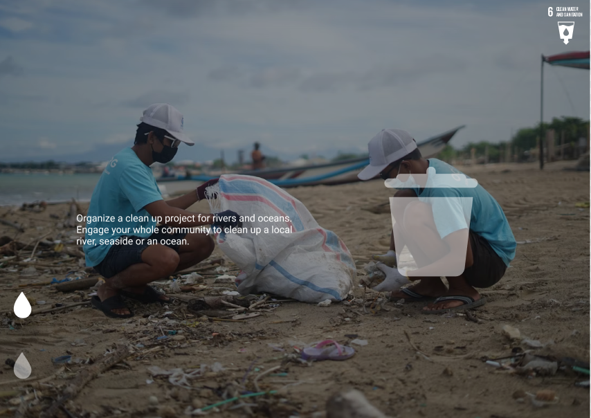
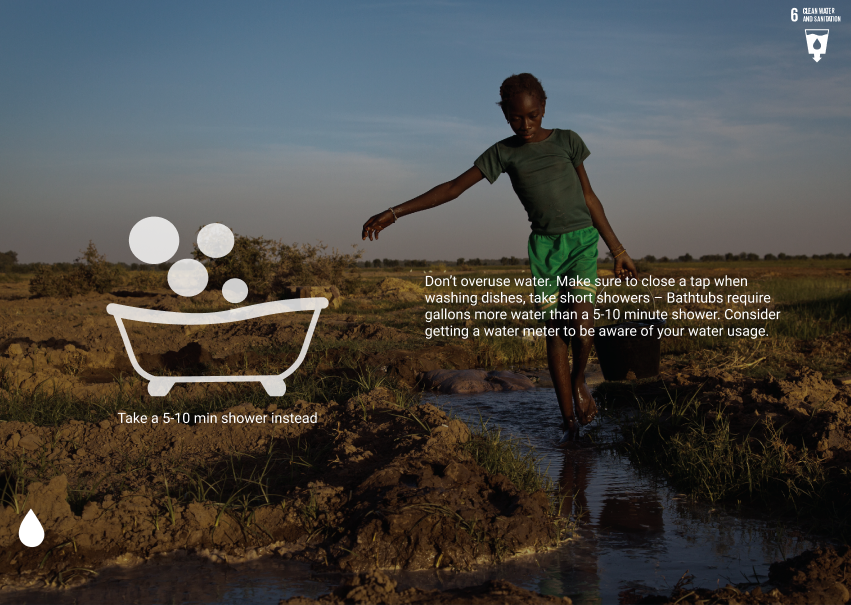
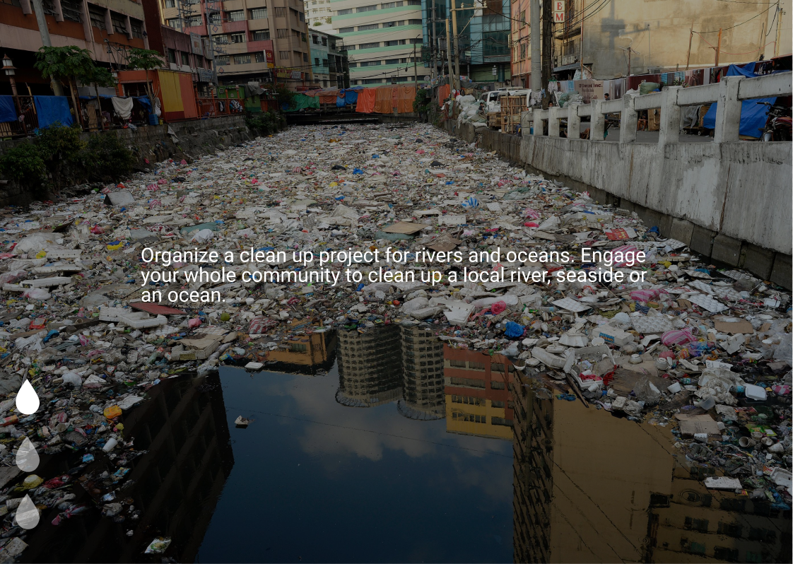
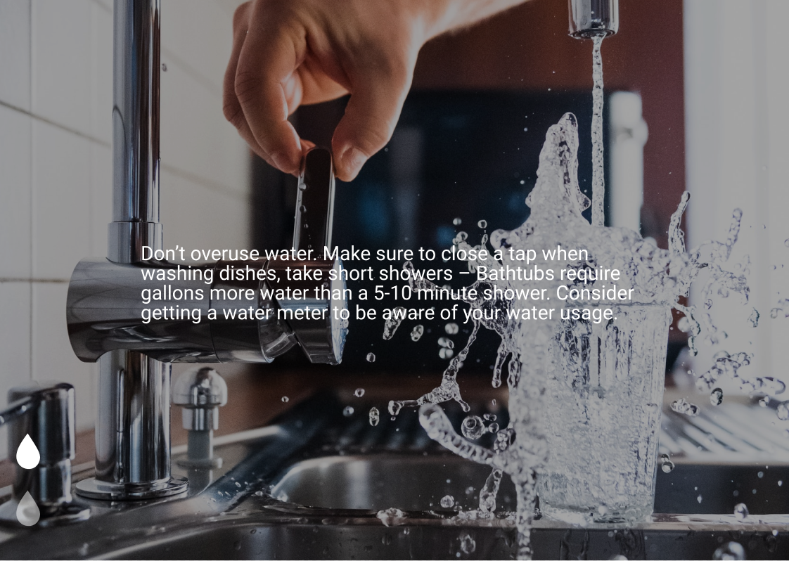
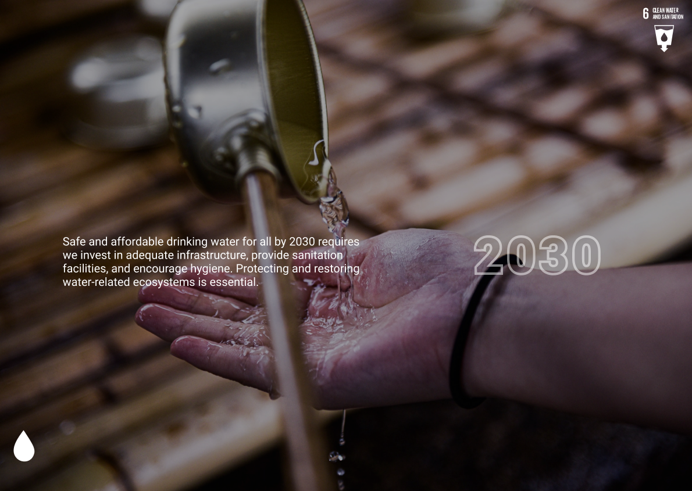

# Assignment2
### Description of the project
The project is a scrollytelling of the sustainable goal 6 Clean Water and sanitation. 

### Why the project is useful
The project is useful, because it will reach out and inform people about the goal. In additon, the project also describes what we can do to improve the situation. 

### Get started with the project
Users can get started with the project by either using the fork option or by cloning this repo. When the user forks the project it is possible to improve the project without ruining our origional project. Then the users can have their own brainstorming, implement new things and share their work with others. 

### Get help with the project
Users can consult learning materials (lectures) or open an issue on this github page.

### Technology
The language used in this project is html, scss, and js. To edit the project we are using Visual Studio Code. 

### Contributes
Henna, Thomas and Ingrid maintains and contributes to the project. 

## Storyboard

### Animations
Scene 1: one big water drop that moves from the glas and goes down to the buttom

Scene 7: water drops moving from the top to bottom 